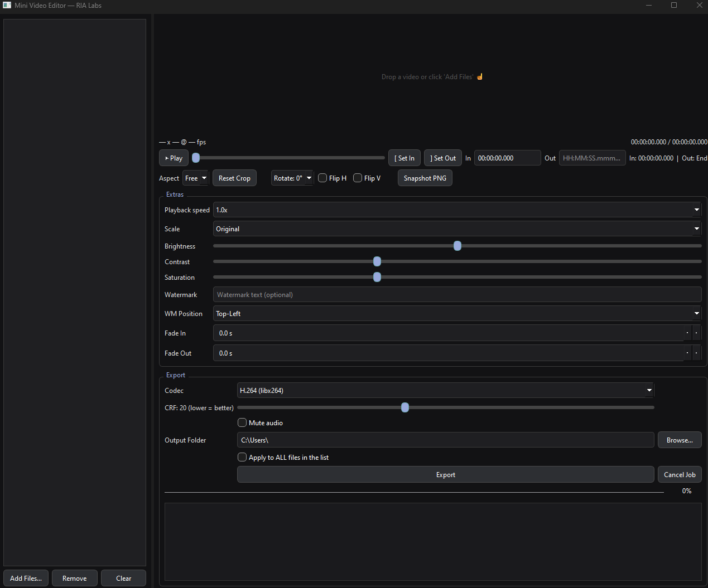

# Mini Video Editor – PyQt6

🎬 **Mini Video Editor** is a lightweight, cross-platform prototype built in **Python (PyQt6)**.  
It provides a dark-themed GUI with basic yet powerful features for trimming, cropping, and editing videos, inspired by professional tools like DaVinci Resolve — but simplified and open for extension.

---

## ✨ Features

- 🖤 **Dark Theme** with high contrast for readability
- 🎚 **Precise trim fields** (`HH:MM:SS.mmm` format) for In/Out points
- ⏩ **Playback speed control** (0.5×, 1.0×, 1.5×, 2.0×)
- ⚫ **Grayscale filter** toggle
- 📝 **Text overlay** field
- 📦 Ready to integrate with **FFmpeg** for exporting
- 🚀 Built on **Python + PyQt6** — lightweight and hackable

---

## 📸 Screenshot




---

## 🔧 Installation

1. Clone the repository:

```bash
git clone https://github.com/nkranidiotis/mini-video-editor.git
cd mini-video-editor
